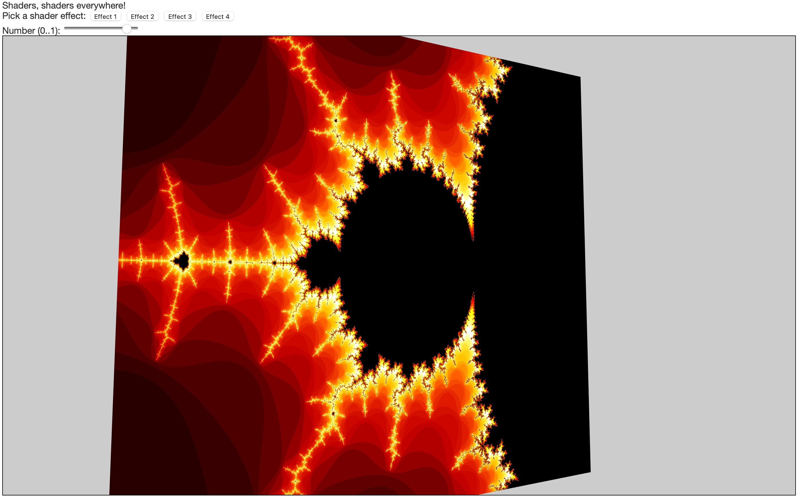

# Assignment 4: Shaders

For this project, you will be programming the GPU using *vertex* and *fragment* hardware shaders to accomplish various visual effects.  As we discussed in class:

* Fragment shaders are used to render individual "fragments" on the screen (basically, they render individual pixels). They are typically used to modify the coloring and lighting of the polygons being rendered.
* Vertex shaders are used to set interpolated inputs to the fragment shaders and possibly modify the vertex positions ```(x,y,z)``` of the polygons being rendered. 

Vertex shaders cannot introduce additional vertices, or delete existing ones -- they are limited by the meshes they are given. (Unlike geometry shaders, which are outside the scope of this class).

Vertex and fragment shaders are used together in pairs, as a *shader program* -- that is, you use one vertex shader and one fragment shader to render something in a particular style, where the outputs of the vertex shader and the inputs of the fragment shader are coordinated.

Reminder: WebGL 1 and 2 use different versions of GLSL (although WebGL 2 is backwards compatible with WebGL 1), and both use older versions of GLSL than the most recent versions of OpenGL. You can find plenty of documentation, explanation, and examples on (webglfundamentals.org)[https://webglfundamentals.org] and (webgl2fundamentals.org)[https://webgl2fundamentals.org], along with the (WebGL1)[https://www.khronos.org/files/webgl/webgl-reference-card-1_0.pdf] and (WebGL2)[https://www.khronos.org/files/webgl/webgl-reference-card-2_0.pdf] quick reference cards.  Everything you need to do for this assignment can be done with the WebGL1 version of GLSL.  

## Due: Tuesday Nov 23rd, 11:59pm

This assignment is graded out of 15.  The assignment is due Tuesday night, but since Wednesday through Friday are holidays, you will incur no late penalty until Saturday.

## Rubric

For this assignment, you will implement three shaders. The three required shaders will be worth 4.5 points each. You may implement a fourth shader for 3 bonus points.  

You will receive 1.5 points for updating the index.html page as described below (descriptions of which shader you are doing, and how you chose to implement it).

For each of the three required shaders, the following criteria will be used:

1. Select a reasonable set of uniforms and attributes for the shader. Modify index.html as described below (button name, description text). (0.5)
2. Modify app.ts to initialize the attributes and uniforms when this shader is used, including updating from the input slider as appropriate. (1)
3. Reasonable code for the shader modifications (even if it doesn't work fully). (1)
4. Shader works as intended. (2) 

## Requirements

**For this project, you will be implementing three or four shader programs**. Two or three of them will have most of the work in the fragment shader, and one of them will have most of the work in the vertex shader. **You have several options for each of the four shaders**, so you can choose whichever seems most interesting to you.  Some of the options in the required shaders can earn you extra credit.  Do not be overwhelmed by the number of options.

**Include a description in your index.html web page describing what shaders you chose to implement, change the button labels to correspond to the shaders you created, and add any details about how you chose to implement them to the page below the canvas!**

If you do not do the fourth shader, leave the shader for the fourth button as the default provided.
 
1. **Texture Generation (fragment shader)**

   Modify the fragment shader to generate a texture on the fly (i.e., do not pass in a texture, or do not use the texture if you pass one in). **Choose one** of the following options:

   1. A checkerboard

      A checkerboard pattern of squares, with alternating black and white squares.  The number of squares within the [u,v] range of [0..1,0..1] (i.e., the plane surface) should vary from 5 to 20, depending on the value of the input slider on the web page.
	
   2. Mandlebrot fractal (1 bonus point)
	
	  Draw the fractal known as the Mandelbrot Set. Display a white or black Mandelbrot set on some colored background. The colors (and possibly color bands) for the background are for you to decide. Let ```z(n+1) = z(n)^2 + c```, where ```z``` and ```c``` are both complex numbers. The Mandelbrot set is essentially a map of what happens when using different values of ```c``` (which correspond to different locations in the plane). Let ```z(0) = (0,0)```, and look at the values ```z(1)=z(0)^2+c, z(2)=z(1)^2+c```, and so on. Repeatedly plugging the result of a function back into itself is called iteration. If these iterated values stay near zero (never leave a circle of radius ```2```), then draw a white or black dot at the location ```c```. If the values do leave the circle, color them something else. Do this for all the values for values of ```c``` such that ```cx``` is in ```[-2..2]``` and ```cy``` is in ```[-2..2]```. The result is the Mandelbrot Set. Use at least 20 iterations of the function to create your Mandelbrot set.
	     
	  To get more interesting color bands, you can color the fragment differently depending on how many iterating it takes for the values to leave the radius. The provided "pal.png" texture contains the colors in the examples, where the number of iterations (relative to the maximum) were used to do the texture lookup.
     
      Here's an example of what the texture might look like:

      
     
      You can vary the range of ```cx``` and ```cy``` used (zooming in on part of their ```[-2..2]``` range) to see some parts in more detail.

      

   3. Julia set fractal ```z(n+1) = z(n)^2 + c, where c = (0, sin(time))``` (1 bonus point)
	
	  This fractal of the Julia set is in some sense the inverse of the Mandlebrot Set. To make a Julia set fractal, use the same equations and iterations as above, but start ```z``` at the current texture coordinate instead of ```(0,0)```, and set ```c = (0, f(sin(time)))```. 
	
	  To get the time, you can pass it in as a uniform variable. As a result you will get a whole bunch of variations of the Julia fractal, animating over time.

       
     
	
   4. Julia set fractal ```z(n+1) = z(n)^6 + c, where c = (0, sin(time)/2.0 + 0.5)``` (1 bonus point)
	
	  Same as (2), but with a different formula to update ```z``` and ```c```.
	
	  Note that ```z^6``` is just computed as the complex multiplication ```z * z * z * z * z * z```, which is easy to write with a for-loop.

      Here are some images of the julia set as a texture, with different ```c``` values controlled by ```sin(time)``` passed in as a uniform.

       
	
2. **Transparency (fragment shader)**

	Modify the fragment shader to do something interesting with transparency. **Choose one** from the following options:

    1. Turn the plane into *swiss cheese* by adding transparent holes all over it. 
	
	   Hint: you can use the *discard* glsl function to "throw away" a particular pixel in a fragment shader, so that it won't be rendered at all). The holes should be circular, but you have some discretion with their radius and spacing.  The input slider should control the size of the holes.
	
    2. Simulate an "x-ray light"
	
	   Make the plane transparent where the diffuse light contribution is brightest. Make the size of the transparent hole "pulse" by changing its size as a smooth function of time (i.e., make the brightness threshold a function of time).  The input slider should control the brightness threshold.
	 	
3. **Vertex Shader**

   Modify the vertex shader to deform the objects. **Choose one** from the following options:
	
   1. Warble

	  Modify the vertices of the quad so that it "warbles" by moving the *y* or *z* component of each vertex with a ```sin``` function of some 
	combination of the *x* component and time (or mouse position). Modify the normal vectors to make the waves darker where they bend.
	
   2. Ripple

	  Like (a), but make the vertices ripple "outward" radially from the center of the plane, like a pebble dropped into a pond. 
	  
      A new wave should start when you press the space key, and last for a few seconds, getting smaller as it moves toward the edge of the quad.
	
	  Modify the normal vectors to make the waves darker where they bend.
	
   3. Orbit

	  Make the shapes smaller, and move them in a circle on the ```x,y``` plane (translating, not rotating) as a function of time or mouse position.

   4. Light phobia

	  Make the shapes "afraid" of the light by moving points away from the light based on the proximity of the specular highlight to
	the vertex (this will make a larger area where the light is bright). 
4. **Image Manipulation (fragment shader)** (**OPTIONAL**, up to 3 bonus points if you do one of these)

   Modify the fragment shader to accept two image textures and do some form of image manipulation to blend two image textures, picking from one of the following options:

   1. Green Screen Removal
	
      Blend the images using green screen removal.  One should be of a "green screen" scene (e.g., like this [picture of Ewan McGregor](http://www.justjared.com/photo-gallery/2777540/ewan-mcgregor-green-screen-fun-with-jimmy-fallon-12/fullsize/)). 
	  The other should be the image you want to blend the green screen image on top of.  
	
	  Green screen removal works by replacing all "predominantly green" pixels in the first image with the pixels from the second image.
	
      Will should pay attention to two details.  First, you cannot assume all green pixels are a specific pixel value;  rather, you should check the pixels 
	  to see how "green" they are and come up with a (simple) metric for when to replace a pixel. Use should use the input slider value to control this threshold, so you can see how changing it affects the removal.
    
      Second (for 1 additional bonus point), you should try to
	  do some blending at the border between green and non-green 
	  (hint: look at the webglfundamentals.org discussion of image manipulation and convolution kernels).
	  You should sample the pixels around the target pixel in your green screened image, to see if it is at the boundary of green and non-green values, 
	  and if so set a transparency value to blend the pixels from the two images.  In other words, in an area of all green, you should display the 
	  background image, and in an area of no green, you should display the green-screen image;  in the boundary, you should blend between the two.  The blend 
	  should be heavily biased to the background to avoid having a green halo around non-green parts of the image.

   2. Brightness based blending
 
      Blend the images using the "lightness" of one image to determine the blend.  
	    
	  The example fragment shader computes a grey-scale "lightness" value of a pixel as a weighted-average of its ```r,g,b``` components. The three components are *not* weighted equally, because the human eye is better at seeing green than red or blue.
	
	  You should use the input slider to control the blend (use the 0..1 value as a threshold). You should have a small window around the threshold value through which blending occurs (e.g., if the threshold is .5, and the window is .1 wide, 
	  then values below .45 are from one image, values above .55 are from the other, and values from .45 to .55 smoothly blend from one image to the other.

## Sample Code

The sample code is similar to the code from the shader example in class, but instead of operating on a sphere, it displays a single quadrilateral (quad) for your shaders.  There are four buttons on the web page that let you pick one of your shaders.  

You should change the text on each button to reflect what the shader effect you chose is, and add text below the canvas describing 
what each effect is.
   
The starting shader code is in the shaders directory.  We've provided four copies of the same simple shader, that computes diffuse lighting from a single light and combines it with a texture.  

There are comments at the top reminding you what uniforms and attributes three.js sets for you.

## Reference material/help on Mandelbrot and Julia sets

Resources that might be helpful include

* https://en.wikipedia.org/wiki/Mandelbrot_set
* https://en.wikipedia.org/wiki/Julia_set
* http://www.wikihow.com/Plot-the-Mandelbrot-Set-By-Hand

# Authorship Rules

The code that you turn in should be entirely your own. You are allowed to talk to other members of the class and to the instructor and the TAs about general implementation of the assignment. It is also fine to seek the help of others for general Typescript and Web programming questions. You may not, however, use code that anyone other than yourself has written. The only exceptions are that you should use your code from Project 1A and the source code that we provide for this project. Code that is explicitly not allowed includes code taken from the Web, GitHub, from books, from other students, or from any source other than yourself. You should not show your code to other students. Feel free to seek the help of the instructor and the TAs for suggestions about debugging your code.

# Submission

You will check out the project from GitHub Classroom, and submit it there.  

**Do Not Change the names** of the existing files (e.g., index.html, app.ts, etc).  The TAs need to be able to test your program as follows:

1. cd into the directory and run ```npm install```
2. run with ```npm run dev```
3. visit ```http://localhost:3000/index.html```

Please test that your submission meets these requirements.  For example, after you check in your final version of the assignment to GitHub, check it out again to a new directory and make sure everything builds and runs correctly.
 
# Development Environment

The development environment is the same as used in previous assignments.

# License

<a rel="license" href="http://creativecommons.org/licenses/by-nc-sa/4.0/"></a><br /><span xmlns:dct="http://purl.org/dc/terms/" property="dct:title">Computer Graphics CS3451 Fall 2021</span> by <a xmlns:cc="http://creativecommons.org/ns#" href="https://github.blairmacintyre.me" property="cc:attributionName" rel="cc:attributionURL">Blair MacIntyre</a> is licensed under a <a rel="license" href="http://creativecommons.org/licenses/by-nc-sa/4.0/">Creative Commons Attribution-NonCommercial-ShareAlike 4.0 International License</a>.

The intent of choosing (CC BY-NC-SA 4.0) is to allow individuals and instructors at non-profit entities to use this content.  This includes not-for-profit schools (K-12 and post-secondary). For-profit entities (or people creating courses for those sites) may not use this content without permission (this includes, but is not limited to, for-profit schools and universities and commercial education sites such as Corsera, Udacity, LinkedIn Learning, and other similar sites).
